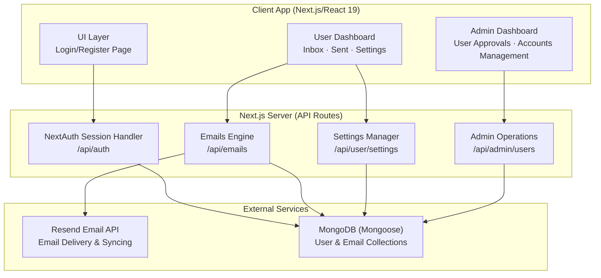
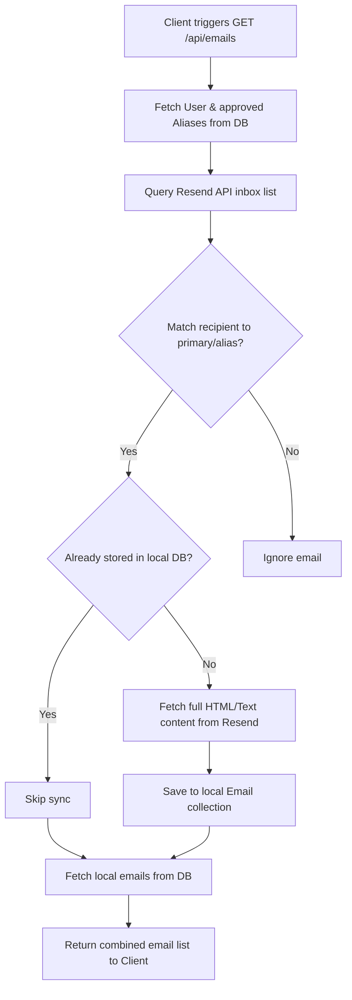

<h1 align="center">Domain Email Workspace Template</h1>
<p align="center">
  <strong>A lightweight, low-cost, self-hosted alternative to traditional business email suites (e.g. Google Workspace, Microsoft 365) for custom domains.</strong><br/>
  <em>Register custom email prefixes, save signature templates, and manage multi-user inboxes — powered by the Resend API and MongoDB.</em>
</p>

<p align="center">
  
  
  
  
  
  
</p>

---

## Table of Contents

- 🔍 [Overview](#overview)
- 🎯 [Why this Self-Hosted Workspace?](#why-this-self-hosted-workspace)
- ✨ [Features](#features)
- 🏗 [Architecture](#architecture)
- 🔄 [Pipeline Flow and How It Works](#pipeline-flow-and-how-it-works)
- 🏃 [Application Walkthrough](#application-walkthrough)
- 🎨 [UI Guide](#ui-guide)
  - [Authentication Page](#authentication-page)
  - [User Dashboard](#user-dashboard)
  - [Admin Portal](#admin-portal)
- 🚀 [Quick Start](#quick-start)
- 🔧 [Environment Configuration](#environment-configuration)
- 📁 [Project Structure and Key Components](#project-structure-and-key-components)
- 📚 [Dependencies](#dependencies)
- ⚠️ [Troubleshooting](#troubleshooting)
- 👤 [Author](#author)

---

## Overview

Traditional business email hosting is expensive, typically requiring monthly per-user licensing fees (ranging from $6 to $18+ per user per month on platforms like Google Workspace or Microsoft 365). 

This **Domain Email Workspace** repository serves as a lightweight, open-source template to escape per-user subscriptions. By pairing a free-tier MongoDB database with the cost-efficient Resend API, you can host a multi-user email dashboard for your custom domain (`yourdomain.com`) for cents a month—or even entirely free under introductory service tiers.

It is designed for start-ups, developers, and small teams who want professional domain email addresses, sender aliases, and custom email signatures from a unified, private dashboard without enterprise-level overhead.

---

## Why this Self-Hosted Workspace?

> **Instead of paying recurring per-user fees for every new inbox or department alias, this template allows you to scale aliases and user accounts dynamically on a single, unified codebase.**

| Feature | Enterprise Cloud Workspace (Gmail / Outlook) | Self-Hosted Domain Workspace |
|---|---|---|
| **Pricing Model** | Linear pricing (e.g. $6/user/month; 10 users = $60/month) | Fixed/usage pricing (Free-tier MongoDB + cents/month for Resend usage) |
| **Privacy and Hosting** | Hosted on enterprise cloud; metadata is indexed | Privately hosted on your own MongoDB database cluster |
| **Domain Control** | Locked into proprietary admin consoles | Integrated with the developer-friendly Resend API for your verified domain |
| **Aliases** | Complex setup, alias creation limits | Create custom sender/recipient suffix aliases instantly from Settings |
| **Templates** | Standard static templates, difficult to manage dynamically | Custom signature template footers selectable directly in the compose modal |
| **Administration** | Bloated settings menus and security roles | Clean Admin Portal for quick user registration approvals and password resets |

---

## Features

### 🎙️ Secure Authentication
- **Role-Based Access**: Restricts unauthorized users, separating access between `ADMIN` and `USER` roles.
- **Registration Approvals**: All newly registered accounts default to a `PENDING` state and require manual approval in the Admin Portal before dashboard features are unlocked.
- **Bcrypt Encryption**: Hashing of user passwords with a salt factor of 10.

### 🧠 Emails Engine
- **Direct Resend API Sync**: Demand-driven synchronization loops fetch incoming emails directly from your Resend inbox and store them locally.
- **Alias Compatibility**: Scans all custom email addresses registered under a user's account and aggregates all matching messages (sent or received).
- **Outbound Dispatcher**: Delivers messages via Resend with dynamic sender address configuration (choose your primary address or any active alias).
- **Simulated Sandbox**: If no Resend API key is provided, the application falls back to a sandbox environment simulating successful delivery and caching records.

### ⚡ Customized Configs
- **Sender Aliases**: Register custom prefixes (e.g. `support`, `hello`, `contact`) under your domain instantly.
- **Template Signatures**: Create and edit markdown/HTML footers which can be automatically attached to outbound messages.
- **Security Updates**: Users can update their password securely from the settings tab.

### 🎨 Admin Center
- **Approvals Dashboard**: Approve or Reject user applications instantly.
- **Accounts Table**: Admin lists all registered accounts and can reset passwords or delete users.
- **Cascade Deletes**: Deleting an account cascades to erase all local email records associated with their primary address or aliases.

---

## Architecture



<details>
<summary>ASCII fallback (click to expand)</summary>

```
┌────────────────────────────────────────────────────────────────────────┐
│                        Self-Hosted Email Workspace                     │
│                                                                        │
│   ┌──────────────────────────────────────────────────────────────┐     │
│   │               Client App (Next.js/React 19)                  │     │
│   │                                                              │     │
│   │  ┌──────────────────┐   ┌────────────────┐   ┌────────────┐  │     │
│   │  │ Login/Register   │   │ User Dashboard │   │Admin Portal│  │     │
│   │  └────────┬─────────┘   └───────┬────────┘   └──────┬─────┘  │     │
│   └───────────┼─────────────────────┼───────────────────┼────────┘     │
│               │                     │                   │              │
│   ┌───────────▼─────────────────────▼───────────────────▼────────┐     │
│   │                 Next.js Server (API Routes)                  │     │
│   │                                                              │     │
│   │  ┌──────────────────┐   ┌────────────────┐   ┌────────────┐  │     │
│   │  │   NextAuth API   │   │  Emails API    │   │ Admin API  │  │     │
│   │  │  (/api/auth)     │   │ (/api/emails)  │   │(/api/admin)│  │     │
│   │  └────────┬─────────┘   └───────┬────────┘   └──────┬─────┘  │     │
│   │           │                     │                   │        │     │
│   │           │             ┌───────▼────────┐          │        │     │
│   │           │             │ Settings API   │          │        │     │
│   │           │             │ (/api/user)    │          │        │     │
│   │           │             └───────┬────────┘          │        │     │
│   └───────────┼─────────────────────┼───────────────────┼────────┘     │
│               │                     │                   │              │
│   ┌───────────▼─────────────────────▼───────────────────▼────────┐     │
│   │                      External Services                       │     │
│   │                                                              │     │
│   │         ┌──────────────────────┐   ┌────────────────────┐    │     │
│   │         │  MongoDB Database    │   │  Resend Email API  │    │     │
│   │         │ (Users/Emails Colls) │   │ (Deliver/Fetch list)    │     │
│   │         └──────────────────────┘   └────────────────────┘    │     │
│   └──────────────────────────────────────────────────────────────┘     │
└────────────────────────────────────────────────────────────────────────┘
```

</details>

---

## Pipeline Flow and How It Works

### Inbox Synchronization Flow

Whenever a dashboard view is mounted or refreshed, the following pipeline executes:



<details>
<summary>ASCII fallback (click to expand)</summary>

```
[Client triggers GET /api/emails]
               │
               ▼
[Fetch User and Approved Aliases from DB]
               │
               ▼
[Query Resend API Incoming Email List]
               │
               ├─────────────────────────────────────────┐
               ▼ (Recipient matches primary/alias?)     ▼ (No match)
     [Yes]                                           [Ignore email]
               │
               ▼ (Already stored locally?)
     [No] ──────────────────────────► [Yes] ────► [Skip sync]
               │                                       │
               ▼                                       │
[Fetch Full Body Content from Resend]                  │
               │                                       │
               ▼                                       │
[Save Inbound Email to local DB]                       │
               │                                       │
               ▼                                       ▼
     ┌─────────────────────────────────────────────────┘
     ▼
[Fetch all Local Emails for Primary/Aliases from DB]
               │
               ▼
[Return Emails Sorted by Date to UI]
```

</details>

---

## Application Walkthrough

### Seeding & Authentication Flow
1. **Initial Boot**: On database connection, the suite runs a seeder checking for an administrative account. If not found, it initializes a generic administrator account (`admin@yourdomain.com`) with the default credentials `admin` / `admin123`.
2. **User Registration**: Users select a registration name, custom prefix, and password. The system registers the pending account (e.g. `user@yourdomain.com`).
3. **Admin Verification**: The administrator logs into the portal, views the pending request, and approves it.
4. **Dashboard Access**: The approved user is now authorized to send and receive emails.

---

## UI Guide

The visual layer uses a fluid, responsive structure styled with modular CSS classes.

| View / Panel | Location | Functional Components |
|---|---|---|
| **Authentication Page** | [src/app/page.tsx](./src/app/page.tsx) | Theme toggler, username/password login fields, custom suffix registration request form. |
| **User Dashboard** | [src/app/dashboard/page.tsx](./src/app/dashboard/page.tsx) | Left Sidebar (inbox, sent, settings tabs, logout), central scrollable email cards list, right reading pane rendering text/HTML body. |
| **Compose Modal** | [src/app/dashboard/page.tsx#L698-L799](./src/app/dashboard/page.tsx#L698-L799) | Sender selection (primary or registered alias), recipient email field, subject line, custom signature template selector, main rich text compose box. |
| **Settings Pane** | [src/app/dashboard/page.tsx#L480-L614](./src/app/dashboard/page.tsx#L480-L614) | Email alias suffix registration, signature template list editor (Create, Edit, Delete), security password update panel. |
| **Admin Portal** | [src/app/admin/page.tsx](./src/app/admin/page.tsx) | Dashboard frame plus: **Approvals** tab (Approve/Reject pending user request tables), **Accounts** tab (Reset passwords and delete accounts with cascaded email cleanup). |

---

## Quick Start

### Prerequisites
- Node.js 20+
- MongoDB instance (Atlas recommended)
- Resend Account (with your custom domain verified in Resend)

### Installation
1. Clone the repository:
   ```bash
   git clone https://github.com/Felix-au/Email-Workspace.git
   cd Email-Workspace
   ```
2. Install npm dependencies:
   ```bash
   npm install
   ```
3. Establish environment settings:
   Create a `.env.local` file in the root folder and copy variables from `.env.example`.
4. Run in development mode:
   ```bash
   npm run dev
   ```
5. Build and launch for production:
   ```bash
   npm run build
   npm start
   ```

---

## Environment Configuration

Configure variables in your local environment file:

| Variable | Description | Default |
|---|---|---|
| `MONGODB_URI` | Connection URI for the MongoDB database cluster | `mongodb+srv://...` |
| `RESEND_API_KEY` | Resend API Credentials | `re_...` |
| `NEXTAUTH_SECRET` | Secret token used to secure user JWT sessions | `your_nextauth_secret` |
| `NEXTAUTH_URL` | Canonical deployment URL | `http://localhost:3000` |

---

## Project Structure and Key Components

```
Email-Workspace/
│
├── src/
│   ├── app/                # Next.js Pages & Routing
│   │   ├── admin/          # Admin Portal UI ([page.tsx])
│   │   ├── api/            # Serverless API routes
│   │   │   ├── admin/      # Admin API Handlers (approvals, password reset, account deletion)
│   │   │   ├── auth/       # NextAuth handler & registration endpoint
│   │   │   ├── emails/     # Syncing & sending API handler
│   │   │   └── user/       # User profile settings (aliases, signatures, password updates)
│   │   ├── dashboard/      # User Dashboard UI ([page.tsx])
│   │   ├── globals.css     # CSS Custom properties, typography rules, animations
│   │   └── page.tsx        # Authentication landing page
│   │
│   ├── components/
│   │   └── Providers.tsx   # React NextAuth Session Provider
│   │
│   ├── lib/
│   │   ├── db.ts           # Mongoose DB connection pooler
│   │   └── resend.ts       # Resend SDK instance builder
│   │
│   ├── models/
│   │   ├── User.ts         # User model, bcrypt verification, & seeder function
│   │   └── Email.ts        # Email model with indexing on resendId
│   │
│   └── types/
│       └── next-auth.d.ts  # NextAuth types schema augmentation
│
├── public/                 # Static assets, logos, and config files
├── .env.example            # Environment variables template
├── package.json            # Scripts & project dependencies
└── tsconfig.json           # TypeScript compilation presets
```

---

## Dependencies

The core modules powering the suite include:

- `next`: ^16.2.10
- `react` & `react-dom`: ^19.2.4
- `next-auth`: ^4.24.14
- `mongoose`: ^9.7.4
- `resend`: ^6.17.2
- `bcryptjs`: ^3.0.3
- `lucide-react`: ^1.24.0

---

## Troubleshooting

| Symptom / Error | Probable Cause | Resolution |
|---|---|---|
| `MONGODB_URI` not defined | Missing local environment file | Create a `.env.local` file in the root directory using the template from `.env.example`. |
| Cannot approve/reject users (Admin) | `PUT`/`PATCH` method mismatch | Ensure the admin client dispatches requests via `PATCH` method (to match `/api/admin/users` API endpoint configuration). |
| Outbound emails fail to send | `RESEND_API_KEY` missing or domain not verified in Resend | Verify your custom domain in your Resend Dashboard, or use a mock API key for local simulation. |
| Incoming emails are not syncing | API key is set to a mock value | A valid production `RESEND_API_KEY` is required to connect to the live Resend receiving endpoint. |

---

## Author

**Felix-au** (Harshit Soni)

- 🔗 GitHub: [github.com/Felix-au](https://github.com/Felix-au)
- 📧 Email: [felixaugum@gmail.com](mailto:felixaugum@gmail.com)

---

<p align="center"><sub>Built to enable private, secure custom domain email workspaces without cloud reliance.</sub></p>
